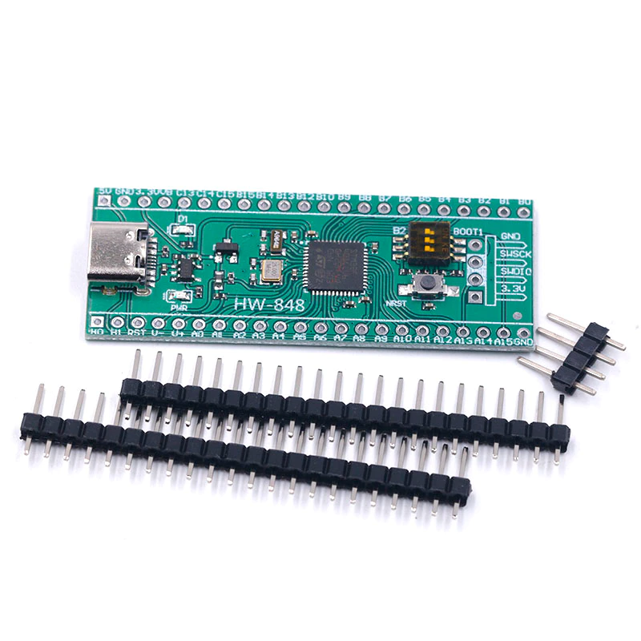
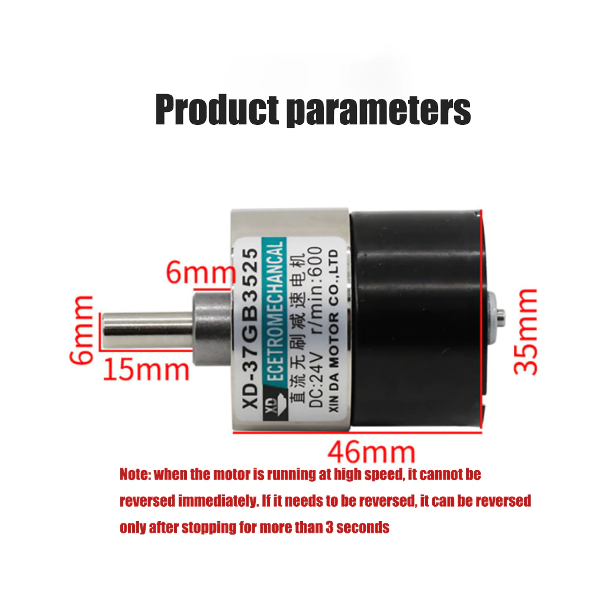
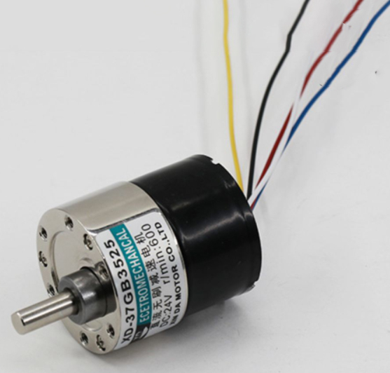
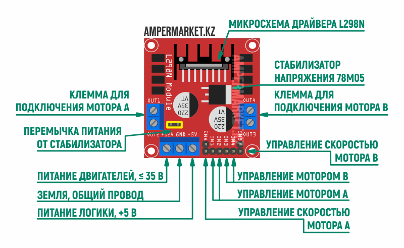
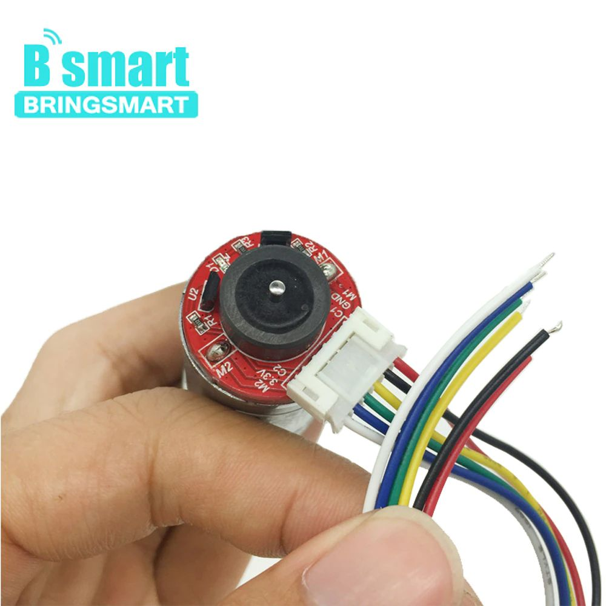

 

Исзодный проект для работы ROS через USB взят отсюда:
https://github.com/yltzdhbc/RosSerialVcp

Проект создан в IDE CLion 2021.2.1

Проект сгененрирован для платы:
Макетная плата STM32F401 STM32F401CCU6 
https://aliexpress.ru/item/4001116638841.html?spm=a2g2w.productlist.0.0.37c72184OQvChE&sku_id=10000014524553288

Откликается публикатор "kek" ROS при связи с RosSerial через USB

Консольная команда запуска RosSerial:
rosrun rosserial_python serial_node.py /dev/ttySTMusb

Консольная команда просмотра вывода публикатора RosSerial:

rostopic echo /kek 

Команда задания мощности BLDC двигателя : 
rostopic pub -1 /bldc/pwr std_msgs/Float32 -- '1.0'

BLDC(бесщёточный двигатель)
https://aliexpress.ru/item/1005003618686420.html?_ga=2.81464791.1301798713.1654004831-997448704.1629886052&sku_id=12000026519796304

Назначение выводов

- чёрный  -  общий
- красный -  +12v
- синий - PWM сигнал от порта с открытым коллектором(стоком)
- белый - реверс двигателя +/- 5v(сигнал от порта с открытым коллектором(стоком))
- жёлтый - выход датчика Холла

Ветка dc_motor_test тест платы драйвера
https://aliexpress.ru/item/1877687415.html?spm=a2g2w.productlist.0.0.7cee189aAVMM8D&sku_id=58892903112

#DC двигатель

Цоколёвка разъёма двигателя - нумерация слева направо

1  M+

2  M-

3  GND  5v

4  VCC +5v

5  OA

6  OB

Цоколёвка разъёма платы для  двигателя - нумерация от низа платы

1  M+

2  GND

3  OA

4  OB

5  VCC

6  M-

#Описание схемы в файле ros_dc_motor.ios

Подключение двигателей

Motor0
------
PWMA_MOTOR_0 (PB9 - 46)  выход PWM сигнала таймера TIM11
______
AIN1_MOTOR_0 (PB15 - 28)

AIN2_MOTOR_0 (PB14 - 27) управление включением и направлением вращения
__________
OA_ENCODER_M0 (PA8 - 29)

OB_ENCODER_M0 (PA9 - 30) Таймер TIM1 режим энкодера

Motor1
------

PWMB_MOTOR_1(PB8 - 45) выход PWM сигнала таймера TIM10
____
BIN1_MOTOR_1(PA4 - 14) 

BIN2_MOTOR_1(PA15 - 38) управление включением и направлением вращения

____
OA_ENCODER_M1(PA5 - 15)

OB_ENCODER_M1(PB3 - 39) Таймер TIM2 режим энкодера

Motor2
------

PWMA_MOTOR_2(PA0 - 10) выход PWM сигнала таймера TIM5 CH1
____

AIN1_MOTOR_2(PB2 - 20)

AIN2_MOTOR_2(PB10 - 21) управление включением и направлением вращения
____

OA_ENCODER_M2(PA6 - 16)

OB_ENCODER_M2(PA7 - 17) Таймер TIM3 режим энкодера

Motor3
------

PWMB_MOTOR_3(PA1 - 11) выход PWM сигнала таймера TIM5 CH2
____
BIN1_MOTOR_3(PB5 - 41)

BIN2_MOTOR_3(PB4 - 40) управление включением и направлением вращения
____
OA_ENCODER_M3(PB6 - 42)

OB_ENCODER_M3(PB7 - 43) Таймер TIM4 режим энкодера

